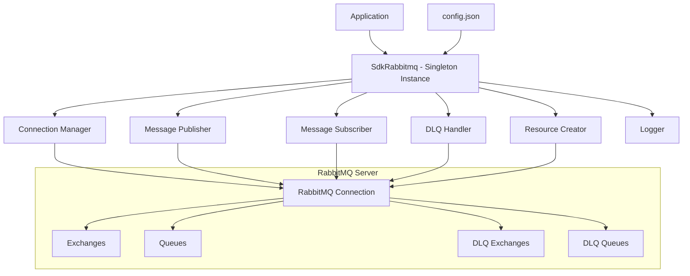
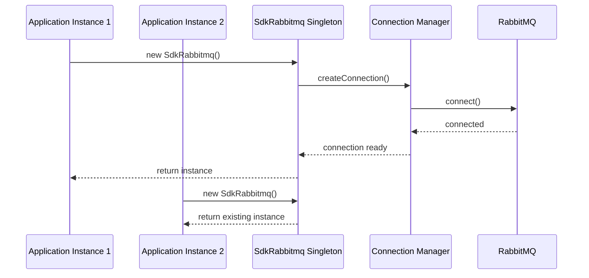
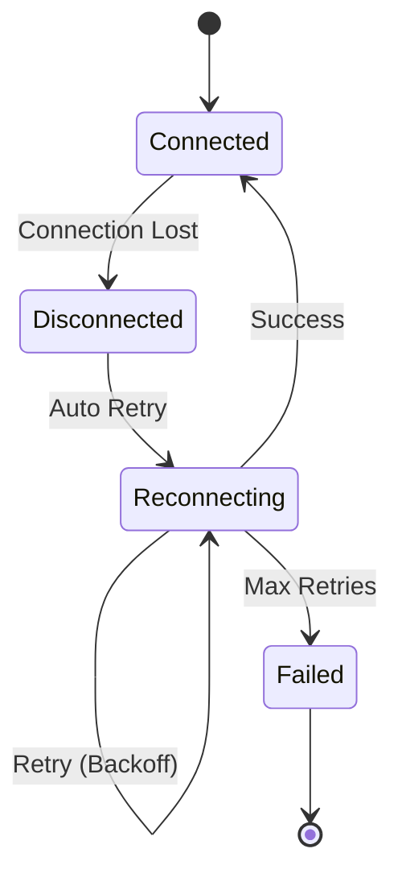

# Design Document - SDK RabbitMQ

## Overview

O SDK RabbitMQ é uma biblioteca Node.js que implementa uma interface simplificada e padronizada para interação com RabbitMQ. O design segue o padrão singleton para garantir uma única conexão por aplicação, com funcionalidades de reconexão automática, auto-criação de recursos, e suporte completo a Dead Letter Queues.

### Principais Características

- Padrão Singleton para conexão única
- Configuração centralizada via config.json
- Interface simplificada com métodos publish() e subscribe()
- Reconexão automática com retry exponencial
- Auto-criação de exchanges e filas
- Suporte completo a Dead Letter Queue
- Sistema de logs estruturado
- Validação de parâmetros obrigatórios

## Architecture

### Arquitetura de Alto Nível



### Padrão Singleton

O SDK implementa um singleton que garante uma única instância conectada por processo Node.js:



## Components and Interfaces

### 1. SdkRabbitmq (Main Class)

```typescript
interface ISdkRabbitmq {
  publish(exchange: string, routingKey: string, payload: any): Promise<boolean>;
  subscribe(exchange: string, queue: string, routingKey: string, callback: MessageCallback): Promise<void>;
  disconnect(): Promise<void>;
}

type MessageCallback = (message: any, ack: () => void, nack: () => void) => void;
```

**Responsabilidades:**
- Implementar padrão singleton
- Expor interface pública (publish/subscribe)
- Coordenar componentes internos
- Gerenciar ciclo de vida da conexão

### 2. ConfigurationManager

```typescript
interface IConfiguration {
  url: string;
  dlq: {
    active: boolean;
    ttl?: number;
    maxRetries?: number;
    retryDelay?: number;
  };
  logging?: {
    level: 'error' | 'warn' | 'info' | 'debug';
    format: 'json' | 'text';
  };
}

interface IConfigurationManager {
  loadConfig(): IConfiguration;
  validateConfig(config: IConfiguration): void;
}
```

**Responsabilidades:**
- Ler e validar config.json
- Fornecer configuração para outros componentes
- Validar schema de configuração

### 3. ConnectionManager

```typescript
interface IConnectionManager {
  connect(): Promise<Connection>;
  getConnection(): Connection | null;
  isConnected(): boolean;
  disconnect(): Promise<void>;
  onConnectionLost(callback: () => void): void;
}
```

**Responsabilidades:**
- Gerenciar conexão singleton com RabbitMQ
- Implementar reconexão automática
- Monitorar estado da conexão
- Implementar retry com backoff exponencial

### 4. MessagePublisher

```typescript
interface IMessagePublisher {
  publish(exchange: string, routingKey: string, payload: any): Promise<boolean>;
}
```

**Responsabilidades:**
- Validar parâmetros de publicação
- Serializar payload para JSON
- Publicar mensagens no RabbitMQ
- Tratar erros de publicação

### 5. MessageSubscriber

```typescript
interface IMessageSubscriber {
  subscribe(exchange: string, queue: string, routingKey: string, callback: MessageCallback): Promise<void>;
  unsubscribe(queue: string): Promise<void>;
}
```

**Responsabilidades:**
- Validar parâmetros de subscrição
- Configurar consumidores
- Deserializar mensagens JSON
- Gerenciar acknowledgments
- Integrar com DLQ Handler

### 6. ResourceCreator

```typescript
interface IResourceCreator {
  ensureExchange(exchange: string, type?: string): Promise<void>;
  ensureQueue(queue: string, options?: QueueOptions): Promise<void>;
  bindQueue(queue: string, exchange: string, routingKey: string): Promise<void>;
}
```

**Responsabilidades:**
- Criar exchanges automaticamente se não existirem
- Criar filas automaticamente se não existirem
- Configurar bindings entre exchanges e filas
- Aplicar configurações padrão

### 7. DLQHandler

```typescript
interface IDLQHandler {
  setupDLQ(originalQueue: string): Promise<string>;
  handleFailedMessage(message: any, originalQueue: string): Promise<void>;
  isEnabled(): boolean;
}
```

**Responsabilidades:**
- Criar exchanges e filas de DLQ
- Rotear mensagens falhadas para DLQ
- Aplicar configurações de TTL e retry
- Gerenciar reprocessamento

### 8. Logger

```typescript
interface ILogger {
  error(message: string, context?: any): void;
  warn(message: string, context?: any): void;
  info(message: string, context?: any): void;
  debug(message: string, context?: any): void;
}
```

**Responsabilidades:**
- Fornecer logging estruturado
- Suportar diferentes níveis de log
- Formatar mensagens consistentemente
- Incluir contexto relevante

## Data Models

### Configuration Schema

```json
{
  "url": "amqp://localhost:5672",
  "dlq": {
    "active": true,
    "ttl": 300000,
    "maxRetries": 3,
    "retryDelay": 5000
  },
  "logging": {
    "level": "info",
    "format": "json"
  }
}
```

### Message Format

```typescript
interface RabbitMQMessage {
  content: Buffer;
  fields: {
    deliveryTag: number;
    redelivered: boolean;
    exchange: string;
    routingKey: string;
  };
  properties: {
    contentType: string;
    timestamp: number;
    messageId: string;
    headers: Record<string, any>;
  };
}

interface ProcessedMessage {
  payload: any;
  metadata: {
    exchange: string;
    routingKey: string;
    timestamp: number;
    deliveryTag: number;
    redelivered: boolean;
  };
}
```

## Error Handling

### Estratégia de Error Handling

1. **Erros de Configuração**: Falha rápida na inicialização
2. **Erros de Conexão**: Retry automático com backoff exponencial
3. **Erros de Publicação**: Log e retorno de false
4. **Erros de Processamento**: Roteamento para DLQ se habilitado

### Tipos de Erro

```typescript
class SdkRabbitmqError extends Error {
  constructor(message: string, public code: string, public context?: any) {
    super(message);
  }
}

// Tipos específicos
class ConfigurationError extends SdkRabbitmqError {}
class ConnectionError extends SdkRabbitmqError {}
class PublishError extends SdkRabbitmqError {}
class SubscriptionError extends SdkRabbitmqError {}
```

### Reconexão Automática



**Configuração de Retry:**
- Delay inicial: 1 segundo
- Multiplicador: 2x
- Delay máximo: 30 segundos
- Tentativas máximas: 10

## Testing Strategy

### Níveis de Teste

1. **Unit Tests**
   - Testes isolados para cada componente
   - Mocks para dependências externas
   - Cobertura de casos de erro

2. **Integration Tests**
   - Testes com RabbitMQ real (via Docker)
   - Validação de fluxos end-to-end
   - Testes de reconexão

3. **Contract Tests**
   - Validação da interface pública
   - Compatibilidade de versões
   - Validação de schemas

### Ferramentas de Teste

- **Jest**: Framework de testes
- **Testcontainers**: RabbitMQ para testes de integração
- **Sinon**: Mocks e stubs
- **Supertest**: Testes de API (se aplicável)

### Cenários de Teste Críticos

1. **Singleton Behavior**
   - Múltiplas instanciações retornam mesmo objeto
   - Estado compartilhado entre instâncias

2. **Reconexão Automática**
   - Perda de conexão durante operações
   - Retry com backoff exponencial
   - Recuperação de estado após reconexão

3. **DLQ Functionality**
   - Roteamento de mensagens falhadas
   - Configuração de TTL e retry
   - Reprocessamento manual

4. **Resource Auto-Creation**
   - Criação automática de exchanges
   - Criação automática de filas
   - Configuração de bindings

5. **Error Scenarios**
   - Configuração inválida
   - Parâmetros obrigatórios ausentes
   - Falhas de rede
   - Mensagens malformadas

### Métricas de Qualidade

- Cobertura de código: > 90%
- Tempo de execução de testes: < 30 segundos
- Testes de integração: Ambiente isolado
- Performance: < 100ms para operações básicas